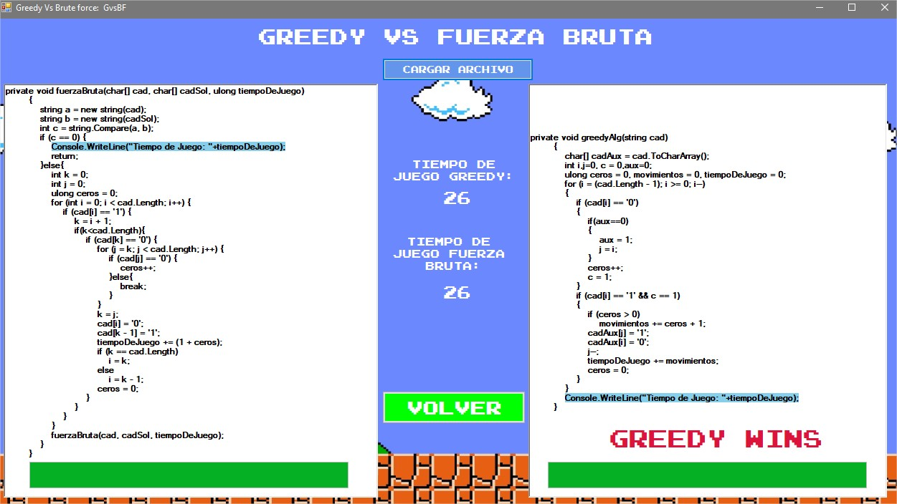

# Final project
This project it's a didactic desktop program that shows the performance of a greedy algorithm against a brute force solution.
The problem that we used to compare the solution is [Bear and row](https://www.codechef.com/APRIL17/problems/ROWSOLD/).
The solution in C language that I submited to CodeChef is the [following](https://www.codechef.com/viewsolution/13534769).

## Here are some screenshots of the program.

### Main menu

### Greedy Algorithm

### Brute force solution

### Code Comparation

